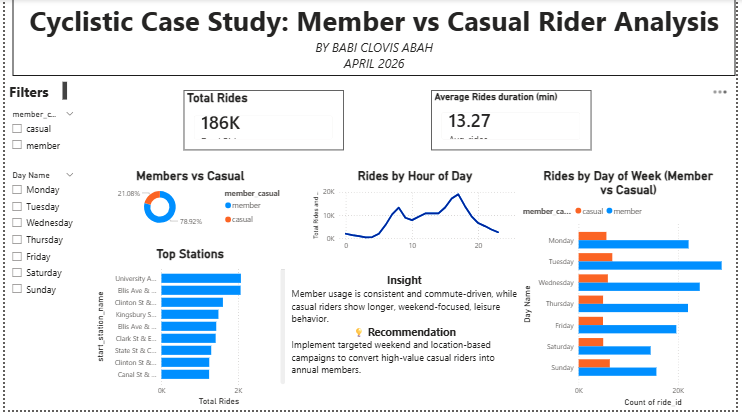

# 🚴 Cyclistic Bike-Share Analysis

## 📌 Project Overview

This project analyzes Cyclistic bike-share data to understand the behavioral differences between casual riders and annual members.

The objective of the analysis is to identify insights and business recommendations that can help convert casual riders into annual members.

This project demonstrates a complete end-to-end analytics workflow using Python, Google Cloud Platform, BigQuery SQL, and Power BI.

---

# 🛠 Tools & Technologies

- Python
- Google Cloud Storage
- BigQuery
- SQL
- Power BI
- GitHub

---

# ⚙️ Data Pipeline Architecture

```text
CSV Files
   ↓
Python ETL Pipeline
   ↓
Google Cloud Storage
   ↓
BigQuery
   ↓
SQL Transformation
   ↓
Power BI Dashboard
```

---

# 🧹 Data Cleaning & Transformation

The raw trip data was cleaned and transformed using SQL in BigQuery.

Key transformations included:

Key transformations included:

- Removing null values
- Removing duplicate records
- Filtering unrealistic ride durations and outliers
- Calculating ride duration
- Extracting day of week
- Extracting ride hour
- Creating analytics-ready tables
A final transformed table called `final_trips` was created for dashboard analysis.

---

# 📊 Dashboard Features

The Power BI dashboard includes:

- Total rides KPI
- Average ride duration
- Rider type distribution
- Ride trends by weekday
- Ride trends by hour
- Top start stations
- Member vs casual rider comparison

---

# 🔍 Key Insights

- Annual members ride more consistently during weekdays.
- Casual riders are more active during weekends.
- Peak ride activity occurs during daytime hours.
- Certain stations generate significantly higher ride traffic.
- Casual riders tend to use the service more for leisure behavior patterns.

---

# 💡 Business Recommendation

Cyclistic should target casual riders during weekends and at high-traffic stations with membership promotions and incentives.

Potential strategies include:
- Weekend membership campaigns
- Discounted annual plans
- In-app targeted marketing
- Promotions at top-performing stations

---

# 📷 Dashboard Preview



---

# 📂 Repository Structure

```text
Cyclistic-Bike-Share-Analysis/
│
├── README.md
│
├── python/
│   └── cyclistic_pipeline.py
│
├── sql/
│   └── final_trips.sql
│
├── dashboard/
│   └── cyclistic_dashboard.pbix
│
└── screenshots/
    └── dashboard.png
```

---

# 🚀 Project Outcome

This project demonstrates:

- Data cleaning and transformation
- ETL pipeline development
- Cloud data integration
- SQL analytics
- Business intelligence reporting
- Data storytelling and insights generation

---

# 👤 Author

Your Name
Babi Clovis Abah

